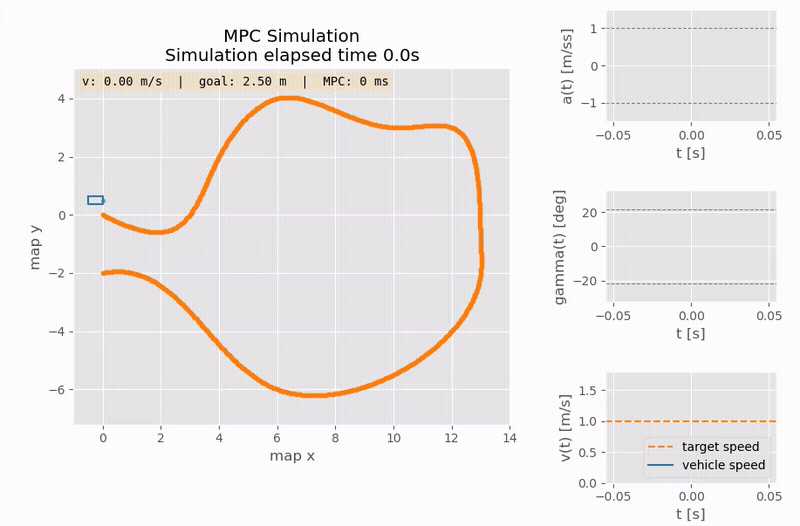

# mpc_python

An (hopefully) easy-to-follow, lightweight* (Iterative) MPC tracking controller built with CVXPY and paired with MuJoCo designed to help anyone looking to transition from basic control to real-time convex optimization.

Also I keep here my (old) notebooks on Model Predictive Control for path-following problems.

This mainly uses **[CVXPY](https://www.cvxpy.org/)** to maintain a strict linear programming framework rather than relying on a non-linear solver like CasADi (which I love btw). But, implementing an iMPC can still bridge the gap between convex optimization and real-world vehicle physics, allowing you to handle non-linear kinematics through iterative linearization.

This repo contains code and ideas from other projects, check them out in the special thanks section.

(* ~12ms per iMPC iteration on my 8th gen Intel CPU)

## Getting started

### Nix Flake ❄️

A [Nix flake](flake.nix) is provided for a reproducible development shell:

```bash
nix develop --impure        # default with extra dev tools
nix develop .#demo --impure # minimal shell just to run the demo
```

GUI demos require `nixGL` (auto-detects Intel/AMD/NVIDIA GPU):

```bash
nixGL python mpc_python/mpc_demo_mujoco.py
```

Headless demos run without it:

```bash
python mpc_python/mpc_demo_nosim.py
```

### Conda

```bash
conda env create -f env.yml
conda activate simulation
```

Then run:

```bash
python3 mpc_demo_mujoco.py
python3 mpc_demo_nosim.py
```

This environment also includes `jupyter lab` to experiment with the notebooks.

## Results

MuJoCo car model is from: *https://github.com/prl-mushr/mushr_mujoco_ros*.

TODO: video and screenshoots


## Notebooks

1. **Model derivation** — analytical and numerical derivation ([1.0](notebooks/1.0-linearised-system-modelling.ipynb), [parametrized curves](notebooks/1.1-parametrized-path-curves.ipynb), [differential](notebooks/models/differential_model.ipynb), [motion model](notebooks/models/motion_model.ipynb))

2. **MPC** — implementation and testing of various tweaks ([2.0](notebooks/2.0-MPC-base.ipynb), [2.1](notebooks/2.1-MPC-with-iterative-linearization.ipynb), [2.2](notebooks/2.2-MPC-v2-car-reference-frame.ipynb), [2.3](notebooks/2.3-MPC-simplified.ipynb))

3. **Obstacle Avoidance** — halfplane constraints to avoid track collisions ([3.0](notebooks/3.0-MPC-v3-track-constrains.ipynb), [3.1](notebooks/3.1-better-track.ipynb)) — Still **work in progress**!

## References & Special Thanks :star: :
* [Prof. Borrelli - mpc papers and material](https://borrelli.me.berkeley.edu/pdfpub/IV_KinematicMPC_jason.pdf)
* [AtsushiSakai - pythonrobotics](https://github.com/AtsushiSakai/PythonRobotics/)
* [alexliniger - mpcc](https://github.com/alexliniger/MPCC) and his [paper](https://onlinelibrary.wiley.com/doi/abs/10.1002/oca.2123)
* [arex18 - rocket-lander](https://github.com/arex18/rocket-lander)
* [prl-mushr - mushr](https://github.com/prl-mushr/mushr_mujoco_ros) for the vehicle used
